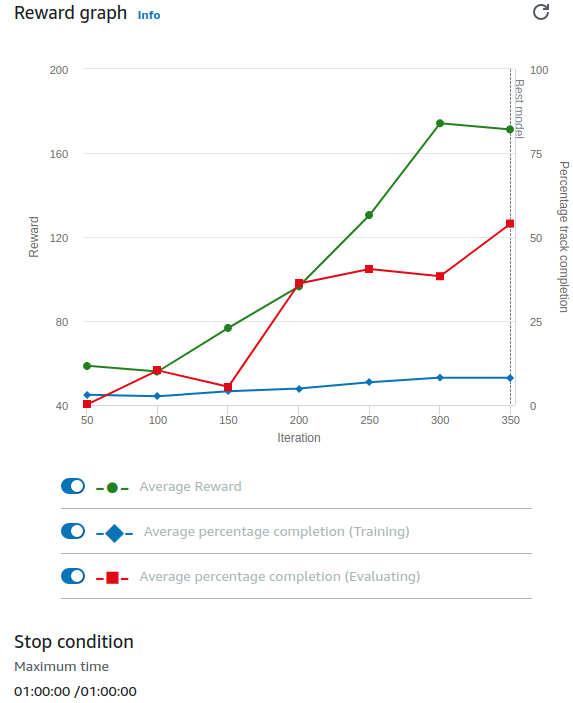

```
def reward_function(params):
    '''
    Example of rewarding the agent to follow center line
    '''

    # Read input parameters
    track_width = params['track_width']
    distance_from_center = params['distance_from_center']

    # Calculate 3 markers that are at varying distances away from the center line
    marker_1 = 0.1 * track_width
    marker_2 = 0.25 * track_width
    marker_3 = 0.5 * track_width

    # Give higher reward if the car is closer to center line and vice versa
    if distance_from_center <= marker_1:
        reward = 1.0
    elif distance_from_center <= marker_2:
        reward = 0.5
    elif distance_from_center <= marker_3:
        reward = 0.1
    else:
        reward = 1e-3  # likely crashed/ close to off track

    return float(reward)
```

|Action number | Steering | Speed|
|----|----|----|
|0	|-30degrees|0.33m/s|
|1	|-30degrees|0.67m/s|
|2	|-30degrees|1m/s|
|3	|0degrees|0.33m/s|
|4	|0degrees|0.67m/s|
|5	|0degrees|1m/s|
|6	|30degrees|0.33m/s|
|7	|30degrees|0.67m/s|
|8	|30degrees|1m/s|


Hyperparameters

|Hyperparameter | Value|
|----|----|
|Gradient descent batch size |	128|
|Entropy |	0.01|
|Discount factor |	0.999|
|Loss type	| Huber|
|Learning rate	 |0.001|
|Number of experience episodes between each policy-updating iteration	| 50|
|Number of epochs	| 10|
